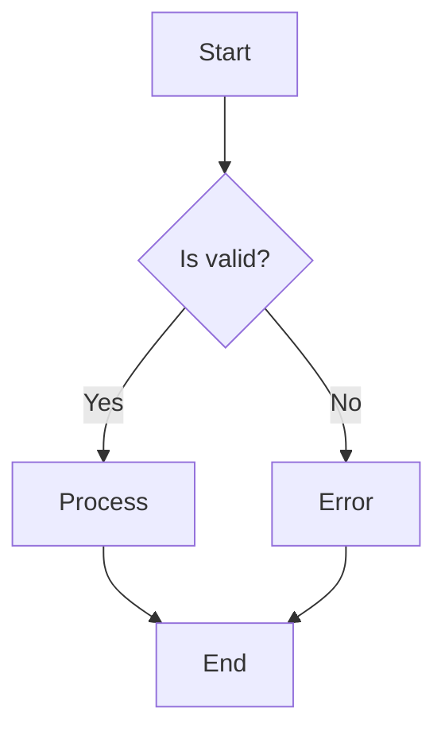
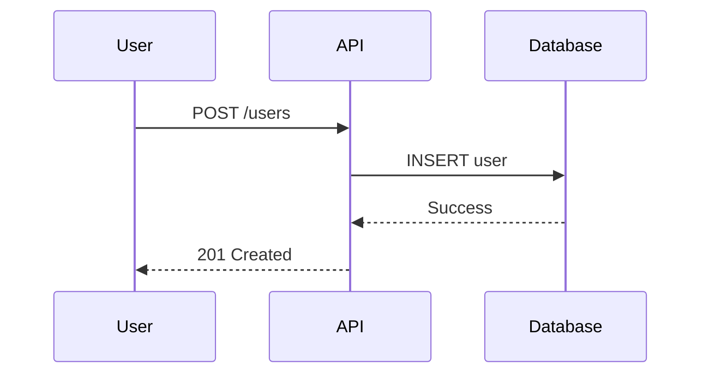
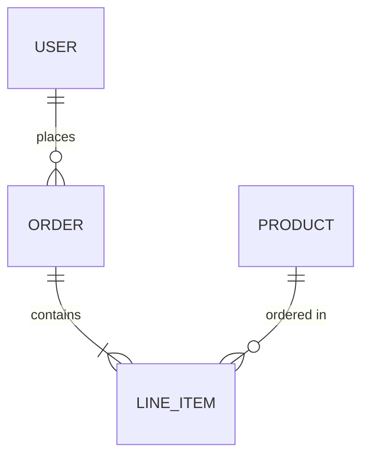
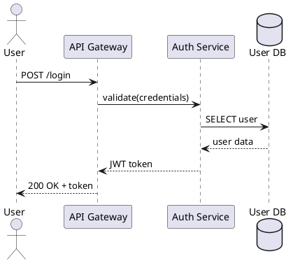
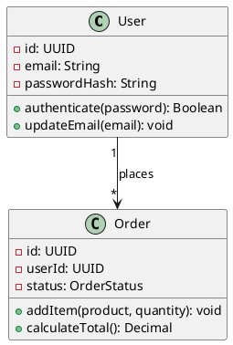

# bosun-docs-writer Research

Research document for the documentation specialist skill.

## Phase 1: Upstream Survey

### 1. obra/superpowers Documentation Skills

The [obra/superpowers](https://github.com/obra/superpowers) repository takes a unique approach to documentation - it treats documentation as integral to skill development rather than as a separate capability. Key findings:

**writing-skills Meta-Skill**
- Located at `skills/writing-skills/SKILL.md`
- Provides comprehensive guidance for creating new skills following best practices
- Uses Test-Driven Development (TDD) principles: "NO SKILL WITHOUT A FAILING TEST FIRST"
- Emphasizes token efficiency for frequently-loaded skills (<150-500 words depending on type)
- Includes Claude Search Optimization (CSO) principles for discoverability

**Documentation Philosophy**
- Skills are "reusable reference guides for proven techniques, patterns, or tools"
- NOT narratives about solving a problem once
- Must be broadly applicable, not project-specific (use CLAUDE.md for project conventions)
- Structured with: Overview, When to Use, Core Pattern, Quick Reference, Implementation, Common Mistakes

**Key Insight from writing-skills**
> "When descriptions summarize workflow, Claude may follow the description instead of reading the full skill. A description saying 'code review between tasks' caused Claude to do ONE review, even though the skill's flowchart showed TWO. Keep descriptions to triggering conditions only."

### 2. VoltAgent/awesome-claude-code-subagents Documentation Agents

The [VoltAgent/awesome-claude-code-subagents](https://github.com/VoltAgent/awesome-claude-code-subagents) repository contains three documentation-focused subagents:

**documentation-engineer** (Category 06 - Developer Experience)
- Role: "Expert documentation engineer specializing in technical documentation systems, API documentation, and developer-friendly content"
- Key competencies: OpenAPI/Swagger integration, information architecture, multi-version management
- Quality metrics: 100% API coverage, tested code examples, WCAG AA accessibility, page load <2s
- Three-phase approach: Documentation Analysis, Implementation Phase, Documentation Excellence

**technical-writer** (Category 08 - Business & Product)
- Role: "Senior technical writer specializing in clear, accurate documentation creation"
- Focus areas: API references, user guides, tutorials, accessibility for diverse audiences
- Quality standards: Readability scores >60, technical accuracy verification, comprehensive examples
- Techniques: Information architecture, progressive disclosure, task-based composition, single-source strategies

**api-documenter** (Category 07 - Specialized Domains)
- Role: "Expert API documenter specializing in comprehensive, developer-friendly API documentation"
- Focus: OpenAPI 3.1 compliance, 100% endpoint coverage, multi-language code examples
- Interactive features: Try-it-out console, code generation, SDK downloads, API explorer
- Documentation types: REST APIs, GraphQL, WebSocket, gRPC, webhooks, SDK references

### 3. Other Claude Code Documentation Plugins

From web search results on [Claude Code plugins](https://code.claude.com/docs/en/plugins):

**Official Plugin Architecture**
- Plugins support: slash commands, agents, MCP servers, hooks, and Skills
- Plugin structure requires `.claude-plugin/plugin.json` manifest
- Commands, agents, skills, hooks directories at plugin root level (NOT inside .claude-plugin/)
- Requires Claude Code v2.0.12 or higher

**Community Resources**
- [claude-plugins.dev](https://claude-plugins.dev/) - Community registry with CLI
- 100+ specialized agents, 110 agent skills, 76 development tools across focused plugins
- Notable projects: CCPlugins (2.6k stars), Claude-Flow (11.4k stars)

### 4. Upstream Summary

| Source | Documentation Approach | Key Strengths |
|--------|----------------------|---------------|
| obra/superpowers | Skills as living documentation | TDD methodology, CSO optimization, token efficiency |
| VoltAgent documentation-engineer | Technical documentation systems | API docs, multi-version management, accessibility |
| VoltAgent technical-writer | User-focused documentation | Readability, progressive disclosure, single-source |
| VoltAgent api-documenter | API-specific documentation | OpenAPI compliance, interactive features, multi-language |

---

## Phase 2: Research Findings

### 1. README.md Best Practices and Templates

**Sources:**
- [Make a README](https://www.makeareadme.com/)
- [Best-README-Template](https://github.com/othneildrew/Best-README-Template)
- [FreeCodeCamp README Guide](https://www.freecodecamp.org/news/how-to-structure-your-readme-file/)
- [The Good Docs Project README Template](https://www.thegooddocsproject.dev/template/readme)
- [README Best Practices - Tilburg Science Hub](https://tilburgsciencehub.com/topics/collaborate-share/share-your-work/content-creation/readme-best-practices/)

**Essential README Sections:**

```markdown
# Project Name

Brief description of what this project does and who it's for.

## Badges
  

## Features
- Key feature 1
- Key feature 2

## Installation

```bash
npm install my-project
```

## Usage

```javascript
import { feature } from 'my-project';
feature.doSomething();
```

## API Reference
Brief API documentation or link to full docs.

## Configuration
Environment variables and configuration options.

## Contributing
See [CONTRIBUTING.md](CONTRIBUTING.md) for guidelines.

## License
[MIT](LICENSE)

## Acknowledgments
Credits and references.
```

**Best Practices:**
1. **Write for your audience** - Use approachable, friendly voice with strong verbs
2. **Be succinct** - Users shouldn't read pages to understand value
3. **Use visuals** - GIFs, screenshots, and demos grab attention
4. **Add badges** - Build status, coverage, license for credibility
5. **Include examples** - Show, don't just tell
6. **Keep updated** - Revisit regularly as project evolves
7. **Use consistent formatting** - Bullet points, code blocks, headers

**When NOT to Include:**
- Installation steps for obvious package managers (link instead)
- Comprehensive API docs (link to dedicated docs site)
- Lengthy tutorials (create separate docs)

---

### 2. API Documentation Standards (OpenAPI, JSDoc, Docstrings)

**Sources:**
- [OpenAPI Best Practices](https://learn.openapis.org/best-practices.html)
- [API Documentation Best Practices 2025 - Theneo](https://www.theneo.io/blog/api-documentation-best-practices-guide-2025)
- [PEP 257 - Docstring Conventions](https://peps.python.org/pep-0257/)
- [JSDoc Official](https://jsdoc.app/)
- [TSDoc Standard](https://tsdoc.org/)
- [Kong API Documentation Guide](https://konghq.com/blog/learning-center/guide-to-api-documentation)

**OpenAPI/Swagger Best Practices:**

```yaml
openapi: 3.1.0
info:
  title: Example API
  version: 1.0.0
  description: |
    API for managing resources.

    ## Authentication
    All endpoints require Bearer token authentication.

paths:
  /users/{id}:
    get:
      summary: Get user by ID
      description: Retrieves a single user by their unique identifier.
      operationId: getUserById
      parameters:
        - name: id
          in: path
          required: true
          description: Unique user identifier
          schema:
            type: string
            format: uuid
            example: "123e4567-e89b-12d3-a456-426614174000"
      responses:
        '200':
          description: User found successfully
          content:
            application/json:
              schema:
                $ref: '#/components/schemas/User'
              example:
                id: "123e4567-e89b-12d3-a456-426614174000"
                name: "Jane Doe"
                email: "jane@example.com"
        '404':
          description: User not found
          content:
            application/json:
              schema:
                $ref: '#/components/schemas/Error'
```

**Key OpenAPI Principles:**
1. **Design-first approach** - Write spec before code
2. **Document all responses** - Including error responses
3. **Provide examples** - For every request/response
4. **Use consistent error format** - Standardize error schema
5. **Document validation rules** - Required fields, length limits, enum values
6. **Include authentication details** - Security schemes and flows

**Python Docstrings (Google Style):**

```python
def calculate_discount(price: float, percentage: float, max_discount: float = None) -> float:
    """Calculate discounted price with optional cap.

    Applies a percentage discount to the given price, optionally
    capping the discount at a maximum value.

    Args:
        price: Original price in dollars. Must be positive.
        percentage: Discount percentage (0-100).
        max_discount: Maximum discount amount. If None, no cap applied.

    Returns:
        The final price after discount.

    Raises:
        ValueError: If price is negative or percentage is out of range.

    Example:
        >>> calculate_discount(100.00, 20)
        80.0
        >>> calculate_discount(100.00, 50, max_discount=25)
        75.0
    """
```

**JSDoc/TSDoc Example:**

```typescript
/**
 * Fetches user data from the API.
 *
 * @param userId - The unique identifier of the user
 * @param options - Optional configuration
 * @param options.includeProfile - Whether to include profile data
 * @param options.timeout - Request timeout in milliseconds
 * @returns Promise resolving to user data
 * @throws {NotFoundError} When user doesn't exist
 * @throws {NetworkError} When request fails
 *
 * @example
 * ```typescript
 * const user = await fetchUser('abc123', { includeProfile: true });
 * console.log(user.name);
 * ```
 */
async function fetchUser(
  userId: string,
  options?: { includeProfile?: boolean; timeout?: number }
): Promise<User> {
  // implementation
}
```

**Actionable Best Practices:**
1. Auto-generate docs from source code/spec files
2. Use validation tools (Spectral, Swagger) in CI
3. Provide copy-paste-ready code examples in multiple languages
4. Document validation rules, not just data types
5. Keep docstrings updated when code changes

---

### 3. CHANGELOG and Versioning

**Sources:**
- [Keep a Changelog](https://keepachangelog.com/en/1.1.0/)
- [Common Changelog](https://common-changelog.org/)
- [Semantic Versioning](https://semver.org/)
- [WordPress Changelog Importance](https://developer.wordpress.org/news/2025/11/the-importance-of-a-good-changelog/)
- [AWS Semantic Versioning Blog](https://aws.amazon.com/blogs/devops/using-semantic-versioning-to-simplify-release-management/)

**CHANGELOG.md Template:**

```markdown
# Changelog

All notable changes to this project will be documented in this file.

The format is based on [Keep a Changelog](https://keepachangelog.com/en/1.1.0/),
and this project adheres to [Semantic Versioning](https://semver.org/spec/v2.0.0.html).

## [Unreleased]

### Added
- New feature being developed

## [1.2.0] - 2024-03-15

### Added
- User authentication via OAuth 2.0
- Rate limiting middleware with configurable thresholds
- Health check endpoint at `/api/health`

### Changed
- Upgraded Node.js requirement from 16 to 18
- Improved error messages for validation failures

### Deprecated
- `GET /api/v1/users` endpoint (use `/api/v2/users` instead)

### Fixed
- Memory leak in connection pooling (#234)
- Race condition in concurrent writes (#256)

### Security
- Updated dependencies to patch CVE-2024-1234

## [1.1.0] - 2024-02-01

### Added
- Initial release with core functionality

[Unreleased]: https://github.com/user/repo/compare/v1.2.0...HEAD
[1.2.0]: https://github.com/user/repo/compare/v1.1.0...v1.2.0
[1.1.0]: https://github.com/user/repo/releases/tag/v1.1.0
```

**Semantic Versioning Rules:**

| Version Component | When to Increment | Example |
|-------------------|-------------------|---------|
| MAJOR (X.0.0) | Breaking changes | Removing API endpoint, changing response format |
| MINOR (0.X.0) | New features (backward compatible) | Adding new endpoint, optional parameter |
| PATCH (0.0.X) | Bug fixes (backward compatible) | Fixing calculation error, patching security issue |

**Best Practices:**
1. **Use ISO date format** - YYYY-MM-DD (e.g., 2024-03-15)
2. **Keep Unreleased section** - Track upcoming changes
3. **Write for humans** - Not commit log dumps
4. **Link to issues/PRs** - Provide context
5. **Highlight breaking changes** - List deprecations and removals prominently
6. **Sort latest-first** - Most recent version at top
7. **Automate when possible** - Use conventional commits with semantic-release

**Do NOT:**
- Dump git commit messages into changelog
- Skip security-related changes
- Leave changelog unmaintained for multiple releases

---

### 4. Code Comments Best Practices

**Sources:**
- [Stack Overflow Code Comments Best Practices](https://stackoverflow.blog/2021/12/23/best-practices-for-writing-code-comments/)
- [TechTarget Clean Code Comments](https://www.techtarget.com/searchsoftwarequality/tip/Code-comment-best-practices-every-developer-should-know)
- [MIT Coding and Comment Style](https://mitcommlab.mit.edu/broad/commkit/coding-and-comment-style/)
- [Swimm Comments Best Practices](https://swimm.io/learn/code-collaboration/comments-in-code-best-practices-and-mistakes-to-avoid)
- [Boot.dev Code Comments](https://blog.boot.dev/clean-code/code-comments/)

**When TO Comment:**

```python
# GOOD: Explains WHY, not what
# Using binary search here because the list is always sorted
# and we need O(log n) for real-time responsiveness
index = binary_search(sorted_users, target_id)

# GOOD: Documents non-obvious business rule
# Discount capped at 30% per legal agreement with partner (see JIRA-1234)
max_discount = min(calculated_discount, 0.30)

# GOOD: Warns about gotchas
# WARNING: This API returns dates in local timezone, not UTC
# Convert before storing in database
response_date = api.get_date()

# GOOD: Links to external reference
# Algorithm based on: https://example.com/research-paper
# Modified to handle edge case of empty input
def process_data(items):
    ...

# GOOD: TODO with context
# TODO(jane): Refactor after v2 migration complete - currently
# maintaining backward compatibility with legacy system
```

**When NOT to Comment:**

```python
# BAD: States the obvious
i = 0  # Initialize i to zero
users.append(user)  # Add user to users list

# BAD: Comments that should be better variable names
# Get the user's full name
n = u.fn + " " + u.ln
# BETTER: No comment needed
full_name = user.first_name + " " + user.last_name

# BAD: Commented-out code (use version control instead)
# old_implementation()
# another_old_thing()
new_implementation()

# BAD: Outdated comment that contradicts code
# Returns user's age in years
def get_user_age_in_months(user):  # Comment is wrong!
    return user.age * 12
```

**Comment Decision Flowchart:**
1. Can I make the code clearer instead? -> Refactor first
2. Does this explain WHY, not WHAT? -> Add comment
3. Is this a non-obvious business rule? -> Add comment
4. Will future me be confused? -> Add comment
5. Is this a known gotcha/workaround? -> Add comment
6. Am I just restating the code? -> Delete comment

**Best Practices:**
1. **Explain intent, not mechanics** - Code shows what, comments explain why
2. **Keep comments updated** - Outdated comments are worse than none
3. **Use self-documenting code** - Good names reduce comment need
4. **Be brief** - Concise comments are more likely to be read and maintained
5. **Delete dead code** - Don't comment it out; use version control

---

### 5. Technical Writing Principles for Developers

**Sources:**
- [Google Developer Documentation Style Guide](https://developers.google.com/style)
- [DEV Community Technical Documentation Guide 2025](https://dev.to/auden/how-to-write-technical-documentation-in-2025-a-step-by-step-guide-1hh1)
- [Technical Writer HQ Good Documentation Practices](https://technicalwriterhq.com/documentation/good-documentation-practices/)
- [MDN Technical Writing Guide](https://developer.mozilla.org/en-US/blog/technical-writing/)
- [adoc Studio Technical Writing Guide](https://www.adoc-studio.app/blog/technical-writing-guide)

**Core Principles (The 3 C's):**
1. **Clarity** - Be direct and unambiguous
2. **Consistency** - Use same terms, formatting throughout
3. **Conciseness** - Remove unnecessary words

**Writing Style Guidelines:**

| Principle | Do | Don't |
|-----------|-----|-------|
| Voice | Use active voice | Use passive voice |
| Person | Second person (you) | Third person (the user) |
| Tense | Present tense | Future tense |
| Sentences | Short, one idea each | Long, compound sentences |
| Jargon | Define or avoid | Assume knowledge |
| Instructions | Put conditions first | Bury conditions at end |

**Examples:**

```markdown
# BAD: Passive, wordy, conditions at end
The configuration file should be edited by the user to include the API key,
which will be required if authentication is needed.

# GOOD: Active, direct, conditions first
If you need authentication, add your API key to the configuration file.
```

```markdown
# BAD: Vague instruction
Configure the settings appropriately.

# GOOD: Specific, actionable
Set `timeout` to 30 seconds and `retries` to 3.
```

**Documentation Framework:**

1. **Project Introduction** - What it is, what problem it solves
2. **Quick Start** - Get users running in 5 minutes
3. **Core Concepts** - Key principles and terminology
4. **Detailed Guides** - Scenario-based walkthroughs
5. **API Reference** - Complete technical specification
6. **FAQ/Troubleshooting** - Common pitfalls and solutions
7. **Changelog** - Version updates and changes

**Code Examples in Docs:**
- Must be **complete** - Include imports and setup
- Must be **tested** - Verify every example works
- Must be **relevant** - Explain what and why
- Must be **copy-paste ready** - Users should be able to run immediately

**Common Mistakes to Avoid:**
1. Overloading with jargon
2. Incomplete steps (leaving users stranded)
3. Burying key information
4. Failing to update documentation
5. Abstract concepts without practical examples

---

### 6. Documentation Generators

**Sources:**
- [MkDocs vs Sphinx Comparison](https://www.pythonsnacks.com/p/python-documentation-generator)
- [Static Site Generators for Documentation](https://justwriteclick.com/2025/02/06/a-flight-of-static-site-generators-sampling-the-best-for-documentation/)
- [15 Best Documentation Tools 2025](https://dev.to/therealmrmumba/i-tried-15-of-the-best-documentation-tools-heres-what-actually-works-in-2025-dam)
- [TypeDoc Official](https://typedoc.org/)
- [Storybook Official](https://storybook.js.org/)

**Comparison Matrix:**

| Tool | Best For | Markup | Learning Curve | Auto-generation |
|------|----------|--------|----------------|-----------------|
| **Sphinx** | Python projects, complex API docs | reStructuredText | Steep | Built-in from docstrings |
| **MkDocs** | Quick setup, Markdown lovers | Markdown | Easy | Via mkdocstrings plugin |
| **TypeDoc** | TypeScript projects | TSDoc comments | Medium | Built-in from source |
| **Docusaurus** | React projects, versioned docs | MDX | Medium | Via plugins |
| **Storybook** | UI components, design systems | MDX/Stories | Medium | Component-driven |

**Sphinx Setup:**

```python
# conf.py
project = 'My Project'
extensions = [
    'sphinx.ext.autodoc',      # Auto-generate from docstrings
    'sphinx.ext.napoleon',     # Support Google/NumPy style
    'sphinx.ext.viewcode',     # Link to source code
    'sphinx_rtd_theme',        # Read the Docs theme
]
html_theme = 'sphinx_rtd_theme'
```

```bash
# Generate docs
sphinx-apidoc -o docs/api src/
sphinx-build -b html docs/ docs/_build/
```

**MkDocs Setup:**

```yaml
# mkdocs.yml
site_name: My Project
theme:
  name: material
  features:
    - navigation.tabs
    - search.highlight
    - content.code.copy

plugins:
  - search
  - mkdocstrings:
      handlers:
        python:
          options:
            show_source: true

nav:
  - Home: index.md
  - Getting Started: getting-started.md
  - API Reference: api/
```

```bash
# Serve locally with live reload
mkdocs serve

# Build static site
mkdocs build
```

**TypeDoc Setup:**

```json
// typedoc.json
{
  "entryPoints": ["src/index.ts"],
  "out": "docs",
  "plugin": ["typedoc-plugin-markdown"],
  "excludePrivate": true,
  "excludeProtected": true
}
```

```bash
npx typedoc --options typedoc.json
```

**Storybook for Component Docs:**

```typescript
// Button.stories.tsx
import type { Meta, StoryObj } from '@storybook/react';
import { Button } from './Button';

const meta: Meta<typeof Button> = {
  title: 'Components/Button',
  component: Button,
  parameters: {
    docs: {
      description: {
        component: 'Primary UI button component with multiple variants.',
      },
    },
  },
  tags: ['autodocs'],
};

export default meta;
type Story = StoryObj<typeof Button>;

export const Primary: Story = {
  args: {
    variant: 'primary',
    children: 'Click me',
  },
};

export const Secondary: Story = {
  args: {
    variant: 'secondary',
    children: 'Click me',
  },
};
```

**When to Use Each:**
- **Sphinx**: Enterprise Python projects, need extensive cross-referencing
- **MkDocs**: Quick setup, prefer Markdown, modern UI with Material theme
- **TypeDoc**: TypeScript libraries, want API docs from source
- **Docusaurus**: React ecosystem, need versioning and i18n
- **Storybook**: Component libraries, design systems, UI documentation

---

### 7. Documentation-as-Code Workflows

**Sources:**
- [Kong Docs as Code Guide](https://konghq.com/blog/learning-center/what-is-docs-as-code)
- [GitBook Docs as Code](https://www.gitbook.com/blog/what-is-docs-as-code)
- [Write the Docs - Docs as Code](https://www.writethedocs.org/guide/docs-as-code/)
- [Fern Docs-as-Code](https://buildwithfern.com/post/docs-as-code)
- [Squarespace Engineering Blog](https://engineering.squarespace.com/blog/2025/making-documentation-simpler-and-practical-our-docs-as-code-journey)

**Core Principles:**

Documentation-as-Code means treating documentation with the same rigor as source code:
- **Version controlled** - Docs live in Git alongside code
- **Reviewed** - Pull requests for doc changes
- **Tested** - CI checks for broken links, style errors
- **Deployed** - Automated publishing via CI/CD

**Typical Workflow:**

```
1. Developer creates feature branch
2. Writes code AND documentation together
3. Opens PR with both code and doc changes
4. Technical writer reviews doc portions
5. CI runs:
   - Link checking
   - Spell checking
   - Style linting
   - Build verification
6. Merge triggers doc deployment
```

**Repository Structure:**

```
project/
├── src/                    # Source code
├── docs/                   # Documentation source
│   ├── index.md
│   ├── getting-started.md
│   ├── api/
│   │   └── reference.md
│   └── assets/
│       └── diagrams/
├── mkdocs.yml              # Doc site config
├── .github/
│   └── workflows/
│       └── docs.yml        # CI for docs
└── README.md
```

**CI/CD Pipeline Example (GitHub Actions):**

```yaml
# .github/workflows/docs.yml
name: Documentation

on:
  push:
    branches: [main]
    paths: ['docs/**', 'mkdocs.yml']
  pull_request:
    paths: ['docs/**', 'mkdocs.yml']

jobs:
  build:
    runs-on: ubuntu-latest
    steps:
      - uses: actions/checkout@v4

      - name: Setup Python
        uses: actions/setup-python@v5
        with:
          python-version: '3.11'

      - name: Install dependencies
        run: pip install mkdocs-material mkdocs-linkcheck

      - name: Check links
        run: mkdocs build --strict

      - name: Deploy (main only)
        if: github.ref == 'refs/heads/main'
        run: mkdocs gh-deploy --force
```

**Benefits of Docs-as-Code:**
1. **Single source of truth** - Docs and code always in sync
2. **Developer-friendly** - Use familiar tools (IDE, Git, PR)
3. **Reviewable** - Same review process as code
4. **Traceable** - Full history of doc changes
5. **Automatable** - CI/CD for quality and deployment

**Real-World Example (Squarespace 2025):**
> "With docs integrated deeply into our workflow, we've put our diagrams next to our code. We can quickly maintain them, and have a tighter feedback loop because of pull requests. The change history of our docs in relation to our code has been greatly enhanced."

---

### 8. Diagramming Tools (Mermaid, PlantUML)

**Sources:**
- [Mermaid vs PlantUML Comparison - Gleek](https://www.gleek.io/blog/mermaid-vs-plantuml)
- [Diagram as Code Tools 2025 - Vinr Academy](https://vinr.academy/blog/diagram-as-code-tools-in-2025-a-comprehensive-comparison)
- [PlantUML vs Mermaid for Sequence Diagrams](https://jimmywongiot.com/2025/08/28/plantuml-vs-mermaid-which-tool-is-best-for-sequence-diagrams-in-markdown/)
- [Automating Diagrams with LLMs](https://cosmo-edge.com/automate-technical-diagrams-llm-mermaid-plantuml-cicd/)
- [draw.io Migration Guide](https://www.drawio.com/blog/plantuml-to-mermaid)

**Comparison:**

| Feature | Mermaid | PlantUML |
|---------|---------|----------|
| **Syntax** | Markdown-like, simple | More verbose, powerful |
| **Learning Curve** | Easy | Steep |
| **Native Support** | GitHub, GitLab, Notion | Confluence, IntelliJ |
| **Diagram Types** | Flowchart, sequence, class, ER, Gantt | Full UML + wireframes, network |
| **Best For** | Quick docs, README | Detailed architecture |
| **Rendering** | Browser-based | Server/local required |

**Mermaid Examples:**







**PlantUML Examples:**





**When to Use Each:**

| Use Case | Recommended Tool |
|----------|------------------|
| Quick README diagrams | Mermaid |
| GitHub/GitLab documentation | Mermaid |
| Detailed UML architecture | PlantUML |
| Enterprise documentation | PlantUML |
| AI-assisted generation | Either (both well-supported) |
| Component relationships | Mermaid |
| Full system architecture | PlantUML |

**Best Practices:**
1. **Keep diagrams simple** - If too complex, split into multiple
2. **Version control diagrams** - Store as code, not images
3. **Automate rendering** - CI pipeline generates images
4. **Use consistent style** - Define conventions for colors, shapes
5. **Add context** - Diagrams should complement, not replace text

**Note:** PlantUML support in draw.io is being phased out at end of 2025. Consider Mermaid for new projects or migration planning.

---

## Audit Checklist Summary

### Critical (Must Have)

- [ ] **README.md exists** with project name, description, installation, and usage
- [ ] **License file** present (LICENSE or LICENSE.md)
- [ ] **API endpoints documented** with request/response examples
- [ ] **Error responses documented** with status codes and messages
- [ ] **Getting started guide** allows new users to run in <5 minutes
- [ ] **All public functions/methods** have docstrings/JSDoc
- [ ] **Breaking changes** clearly documented in CHANGELOG
- [ ] **Authentication/authorization** fully documented
- [ ] **No commented-out code** committed to repository

### Important (Should Have)

- [ ] **CHANGELOG.md** following Keep a Changelog format
- [ ] **CONTRIBUTING.md** with contribution guidelines
- [ ] **Semantic versioning** used consistently
- [ ] **Code examples tested** and verified working
- [ ] **Architecture diagram** for system overview
- [ ] **Environment variables** documented with examples
- [ ] **Configuration options** documented with defaults
- [ ] **Troubleshooting section** with common issues
- [ ] **Badges** for build status, coverage, version
- [ ] **Deprecation notices** with migration paths
- [ ] **Comments explain WHY**, not what

### Recommended (Nice to Have)

- [ ] **Interactive API documentation** (Swagger UI, Redoc)
- [ ] **Multi-language code examples** for major languages
- [ ] **Storybook or similar** for UI components
- [ ] **Docs-as-code workflow** with CI/CD
- [ ] **Documentation linting** in CI pipeline
- [ ] **Link checking** automated
- [ ] **Accessibility compliance** (WCAG AA)
- [ ] **Search functionality** in documentation site
- [ ] **Version selector** for multi-version docs
- [ ] **Changelog RSS feed** for subscribers
- [ ] **Mermaid/PlantUML diagrams** as code
- [ ] **API SDK documentation** per supported language
- [ ] **Video tutorials** for complex features
- [ ] **Runnable examples** (CodeSandbox, StackBlitz)

---

## References

### Upstream Resources
- [obra/superpowers](https://github.com/obra/superpowers) - Skills framework with documentation best practices
- [VoltAgent/awesome-claude-code-subagents](https://github.com/VoltAgent/awesome-claude-code-subagents) - Documentation-focused subagents

### README Resources
- [Make a README](https://www.makeareadme.com/)
- [Best-README-Template](https://github.com/othneildrew/Best-README-Template)
- [The Good Docs Project README Template](https://www.thegooddocsproject.dev/template/readme)

### API Documentation
- [OpenAPI Best Practices](https://learn.openapis.org/best-practices.html)
- [API Documentation Best Practices 2025 - Theneo](https://www.theneo.io/blog/api-documentation-best-practices-guide-2025)
- [Kong API Documentation Guide](https://konghq.com/blog/learning-center/guide-to-api-documentation)

### Changelogs and Versioning
- [Keep a Changelog](https://keepachangelog.com/en/1.1.0/)
- [Semantic Versioning](https://semver.org/)
- [Common Changelog](https://common-changelog.org/)

### Code Comments
- [Stack Overflow Code Comments Best Practices](https://stackoverflow.blog/2021/12/23/best-practices-for-writing-code-comments/)
- [MIT Coding and Comment Style](https://mitcommlab.mit.edu/broad/commkit/coding-and-comment-style/)

### Technical Writing
- [Google Developer Documentation Style Guide](https://developers.google.com/style)
- [Write the Docs](https://www.writethedocs.org/)
- [MDN Technical Writing Guide](https://developer.mozilla.org/en-US/blog/technical-writing/)

### Documentation Generators
- [Sphinx Documentation](https://www.sphinx-doc.org/)
- [MkDocs](https://www.mkdocs.org/)
- [TypeDoc](https://typedoc.org/)
- [Storybook](https://storybook.js.org/)
- [Docusaurus](https://docusaurus.io/)

### Docs-as-Code
- [Write the Docs - Docs as Code](https://www.writethedocs.org/guide/docs-as-code/)
- [GitBook Docs as Code](https://www.gitbook.com/blog/what-is-docs-as-code)

### Diagramming
- [Mermaid](https://mermaid.js.org/)
- [PlantUML](https://plantuml.com/)
- [Diagram as Code Tools 2025](https://vinr.academy/blog/diagram-as-code-tools-in-2025-a-comprehensive-comparison)

### Claude Code Plugins
- [Claude Code Plugins Documentation](https://code.claude.com/docs/en/plugins)
- [Claude Code GitHub](https://github.com/anthropics/claude-code)
